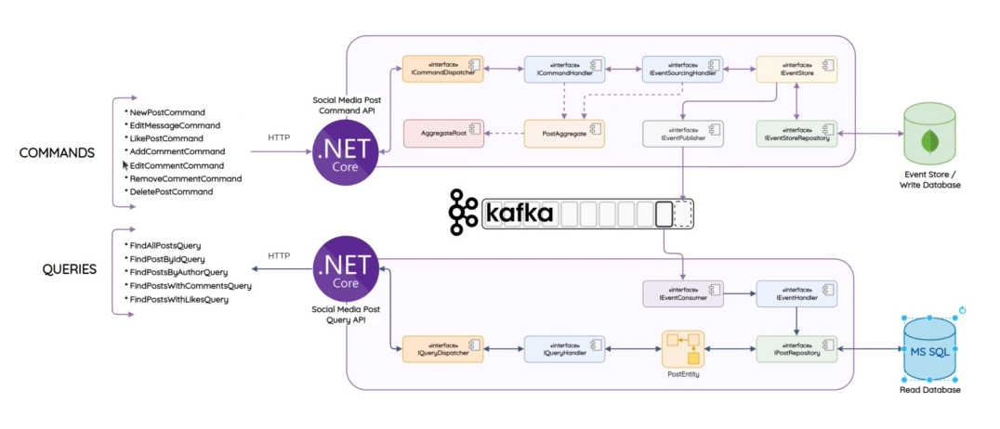

## Architecture Flow (CQRS + Event Sourcing)



### Data Storage Summary

| Component                | Database | What's Stored                                      | Why |
|--------------------------|----------|----------------------------------------------------|-----|
| **EventStore**           | MongoDB  | `EventModel` documents (all past events as BSON)   | **Schema-less** = events with different fields (e.g. `Author` vs `Likes`) don't need migrations. Append-only = no updates, perfect for event sourcing |
| **EventProducer**        | Kafka    | Serialized events (transient, for consumers)        | **Message broker** decouples write & read services. If Query API is down, Kafka retains messages until it's back |
| **PostRepository** (cmd) | MongoDB  | EventModels via `IEventStoreRepository`             | Same as EventStore — just the repository layer on top of the same MongoDB collection |
| **PostRepository** (query)| MSSQL   | `PostEntity`, `CommentEntity` (read-optimized)     | **Relational** = easy to query, join Posts ↔ Comments, run aggregations. This is the read model — deliberately different from write model (CQRS) |

### Write Flow (Post.Cmd.Api)

| # | Step | What Happens | Why |
|---|------|--------------|-----|
| 1 | **Controller** receives HTTP request → creates command (e.g. `NewPostCommand`) | Entry point — maps HTTP to a command object with all input data |
| 2 | **CommandDispatcher** looks up handler in `Dictionary<Type, Func>` → routes to `CommandHandler` | Acts as a mediator so controllers don't depend on handlers directly |
| 3 | **CommandHandler** calls `EventSourcingHandler.SaveAsync(aggregate)` | Orchestrator — coordinates loading, validating, and saving. Doesn't know DB details |
| 4 | **EventSourcingHandler** loads past events from MongoDB → `ReplayEvents()` restores aggregate state | Loads aggregate to current state by replaying all prior events (rebuilds `_author`, `_active`, `_comments`) |
| 5 | **AggregateRoot** validates business rules → `RaiseEvent()` → `Apply()` mutates local state + tracks `_changes` | Pure domain logic (no I/O). Validates (e.g. "is post active?", "is user the author?"). `RaiseEvent` calls `Apply` to mutate state + stores event in `_changes` list |
| 6 | **EventStore** wraps each event in `EventModel` → saves to **MongoDB** + publishes to **Kafka** | **Dual-write**: MongoDB for permanent record (event sourcing), Kafka for broadcasting to read side |
| 7 | **EventProducer** serializes event to JSON → produces to Kafka topic | Uses Confluent.Kafka. Serializes with `@event.GetType()` so type info is preserved for the consumer |

### Read Flow (Post.Query.Api)

| # | Step | What Happens | Why |
|---|------|--------------|-----|
| 8 | **ConsumerHostedService** (background) polls Kafka continuously | `BackgroundService` — runs as long as the app is alive, keeping the read DB in sync |
| 9 | **EventConsumer** deserializes JSON → `EventJsonConverter` picks concrete event class via `Type` field | Can't deserialize abstract `BaseEvent`. Converter reads the `Type` field from JSON and picks the right concrete class (e.g. `PostCreatedEvent`) |
| 10 | Reflection finds `EventHandler.On(ConcreteEvent)` and invokes it | No switch/if-chain needed. Just by convention: method name `On` + event type = dispatch target |
| 11 | **EventHandler** creates/updates `PostEntity` or `CommentEntity` via Repository | Transforms event data into the read-optimized entity model (flat tables, no event-sourcing complexity) |
| 12 | **PostRepository** / **CommentRepository** saves to **MSSQL** via EF Core | Write-optimized DB (MongoDB) and read-optimized DB (MSSQL) are **separate** — CQRS pattern in action |

### Project Structure

| Project | What It Does | Why Separate? |
|---------|--------------|---------------|
| **Post.Cmd.Api** | ASP.NET Web API. Controllers receive HTTP requests, create commands, dispatch them | **Entry point** for write operations. Thin layer — just HTTP mapping and DI setup |
| **Post.Cmd.Domain** | The `PostAggregate` — validates business rules, raises events via `RaiseEvent()` + `Apply()` | **Pure domain logic** with zero I/O dependencies. No database, no Kafka — just rules. Testable in isolation |
| **Post.Cmd.Infrastructure** | `EventStore`, `EventProducer`, `EventStoreRepository`, `EventSourcingHandler`, `CommandDispatcher` | **All I/O lives here** — MongoDB, Kafka, dispatching. Domain doesn't know about any of this (Dependency Inversion) |
| **Post.Query.Api** | ASP.NET Web API + `ConsumerHostedService`. Runs the Kafka consumer and hosts the read API | **Separate process** from write side. Can scale independently (e.g. 1 write instance, 3 read instances) |
| **Post.Query.Domain** | `PostEntity`, `CommentEntity`, `IPostRepository`, `ICommentRepository` interfaces | **Read model entities** are flat POCOs (no event sourcing complexity). Interfaces keep domain clean from EF Core |
| **Post.Query.Infrastructure** | `EventConsumer`, `EventHandler`, `PostRepository`, `DatabaseContext`, `EventJsonConverter` | **All query-side I/O** — Kafka consumption, MSSQL via EF Core, JSON deserialization |
| **Post.Common** | Shared event classes: `PostCreatedEvent`, `PostLikedEvent`, `CommentAddedEvent`, etc. | **Shared contract** between write & read sides. Both projects need to know the same event types |
| **CQRS.Core** | Abstract base: `AggregateRoot`, `BaseEvent`, `CommandDispatcher` interfaces, `EventModel` | **Reusable framework** — can be extracted into a NuGet package for other CQRS microservices |
```shell
dotnet watch run --project Post.Cmd/Post.Cmd.Api --launch-profile http
dotnet watch run --project Post.Query/Post.Query.Api --launch-profile http
```

```sql
--- Dont create user if it already exists
Use
SocialMedia
GO

IF NOT EXISTS(SELECT *
              FROM sys.server_principals
              WHERE name = 'SMUser')
BEGIN
        CREATE
LOGIN SMUser WITH PASSWORD =N'SmPA$$12345', DEFAULT_DATABASE = SocialMedia
END

IF
NOT EXISTS(SELECT *
              FROM sys.database_principals
              WHERE name = 'SMUser')
BEGIN
--- Add user to owner of DB owner
EXEC sp_adduser 'SMUser', 'SMUser', 'db_owner'
END
```

```sh
# 006 Basic Project Setup.mp4 
# Create class lib in CQRS.Core folder
dotnet new classlib -o CQRS.Core
# Create solution
dotnet new sln

# In SM-Post
dotnet new webapi -o Post.Cmd.Api
dotnet new classlib -o Post.Cmd.Domain

# In Post.Query
dotnet new webapi -o Post.Query.Api
dotnet new classlib -o Post.Query.Domain
dotnet new classlib -o Post.Query.Infrastructure

# in SM-Post 
# Add All projects to solution
dotnet sln add ../CQRS-ES/CQRS.Core/CQRS.Core.csproj

dotnet sln add Post.Cmd/Post.Cmd.Api/Post.Cmd.Api.csproj 
dotnet sln add Post.Cmd/Post.Cmd.Domain/Post.Cmd.Domain.csproj
dotnet sln add Post.Cmd/Post.Cmd.Infrastructure/Post.Cmd.Infrastructure.csproj

dotnet sln add Post.Query/Post.Query.Api/Post.Query.Api.csproj
dotnet sln add Post.Query/Post.Query.Domain/Post.Query.Domain.csproj
dotnet sln add Post.Query/Post.Query.Infrastructure/Post.Query.Infrastructure.csproj 

# Add project references
dotnet add Post.Cmd/Post.Cmd.Api/Post.Cmd.Api.csproj reference ../CQRS-ES/CQRS.Core/CQRS.Core.csproj
dotnet add Post.Cmd/Post.Cmd.Api/Post.Cmd.Api.csproj reference Post.Cmd/Post.Cmd.Domain/Post.Cmd.Domain.csproj
dotnet add Post.Cmd/Post.Cmd.Api/Post.Cmd.Api.csproj reference Post.Cmd/Post.Cmd.Infrastructure/Post.Cmd.Infrastructure.csproj

# Add common class Lib
dotnet new classlib -o Post.Common

# Add project references
dotnet add Post.Cmd/Post.Cmd.Api/Post.Cmd.Api.csproj reference Post.Common/Post.Common.csproj
dotnet add Post.Cmd/Post.Cmd.Domain/Post.Cmd.Domain.csproj reference ../CQRS-ES/CQRS.Core/CQRS.Core.csproj 
dotnet add Post.Cmd/Post.Cmd.Domain/Post.Cmd.Domain.csproj reference Post.Common/Post.Common.csproj

dotnet add Post.Cmd/Post.Cmd.Infrastructure/Post.Cmd.Infrastructure.csproj reference ../CQRS-ES/CQRS.Core/CQRS.Core.csproj
dotnet add Post.Cmd/Post.Cmd.Infrastructure/Post.Cmd.Infrastructure.csproj reference Post.Cmd/Post.Cmd.Domain/Post.Cmd.Domain.csproj

dotnet add Post.Common/Post.Common.csproj reference ../CQRS-ES/CQRS.Core/CQRS.Core.csproj 

dotnet add Post.Query/Post.Query.Api/Post.Query.Api.csproj reference ../CQRS-ES/CQRS.Core/CQRS.Core.csproj
dotnet add Post.Query/Post.Query.Api/Post.Query.Api.csproj reference Post.Query/Post.Query.Domain/Post.Query.Domain.csproj
dotnet add Post.Query/Post.Query.Api/Post.Query.Api.csproj reference Post.Query/Post.Query.Infrastructure/Post.Query.Infrastructure.csproj
dotnet add Post.Query/Post.Query.Api/Post.Query.Api.csproj reference Post.Common/Post.Common.csproj

dotnet add Post.Query/Post.Query.Domain/Post.Query.Domain.csproj reference Post.Common/Post.Common.csproj 
dotnet add Post.Query/Post.Query.Domain/Post.Query.Domain.csproj reference ../CQRS-ES/CQRS.Core/CQRS.Core.csproj
dotnet add Post.Query/Post.Query.Domain/Post.Query.Domain.csproj reference Post.Common/Post.Common.csproj 

dotnet add Post.Query/Post.Query.Infrastructure/Post.Query.Infrastructure.csproj reference ../CQRS-ES/CQRS.Core/CQRS.Core.csproj
dotnet add Post.Query/Post.Query.Infrastructure/Post.Query.Infrastructure.csproj reference Post.Query/Post.Query.Domain/Post.Query.Domain.csproj


```